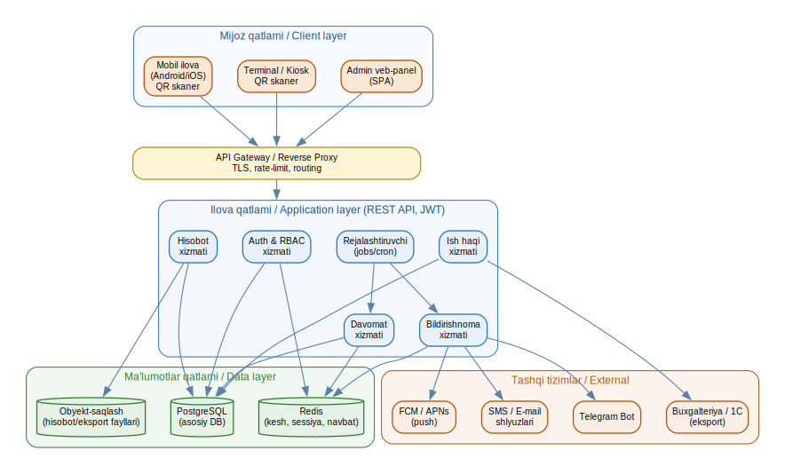
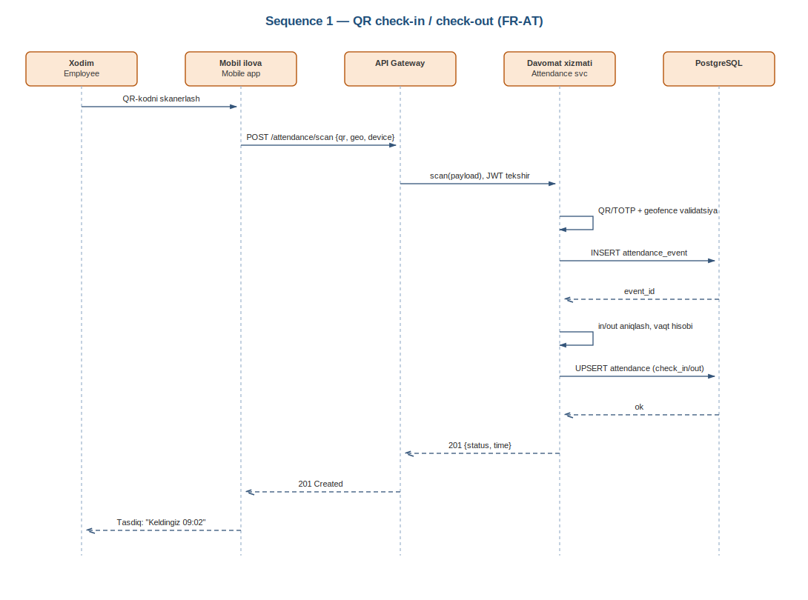
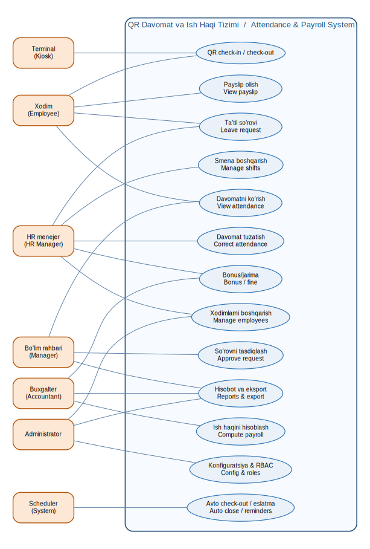
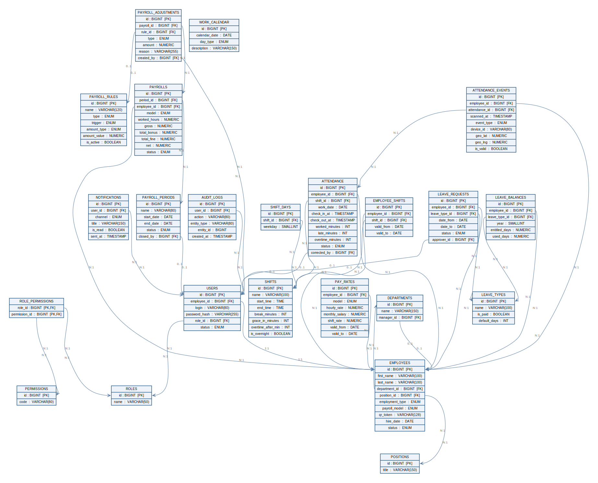

<div align="center">

# 🕐 TimeGate

### QR-kod asosidagi davomat va ish haqi boshqaruv tizimi
### QR-based Attendance & Payroll Management System

[](https://openjdk.org/projects/jdk/17/)
[](https://spring.io/projects/spring-boot)
[](https://react.dev/)
[](https://www.typescriptlang.org/)
[](https://www.postgresql.org/)
[](https://expo.dev/)
[](https://www.docker.com/)
[](#-litsenziya--license)

**Monorepo:** Spring Boot backend · React (Vite) admin veb · React Native (Expo) mobil

</div>

---

## 📋 Mundarija / Table of Contents

- [Loyiha haqida / About](#-loyiha-haqida--about)
- [Asosiy imkoniyatlar / Features](#-asosiy-imkoniyatlar--features)
- [Texnologiyalar / Tech stack](#-texnologiyalar--tech-stack)
- [Arxitektura / Architecture](#-arxitektura--architecture)
- [Ma'lumotlar bazasi / Database](#-malumotlar-bazasi--database)
- [Tuzilma / Project structure](#-tuzilma--project-structure)
- [Ishga tushirish / Getting started](#-ishga-tushirish--getting-started)
- [Demo hisoblar / Demo accounts](#-demo-hisoblar--demo-accounts)
- [API endpoint'lar / API endpoints](#-api-endpointlar--api-endpoints)
- [Testlar / Tests](#-testlar--tests)
- [Docker](#-docker)
- [CI/CD](#-cicd)
- [Yo'l xaritasi / Roadmap](#-yol-xaritasi--roadmap)
- [Litsenziya / License](#-litsenziya--license)

---

## 🎯 Loyiha haqida / About

**TimeGate** — tashkilotlarda xodimlar davomatini **QR-kod** orqali avtomatlashtiradigan va shu asosda **ish haqini** hisoblaydigan to'liq tizim. Xodim QR-kodini kioskda yoki mobil ilovada skanerlaydi → tizim kelish/ketish vaqtini, kechikish va overtime'ni yozadi → davr oxirida ish haqi avtomatik hisoblanadi (bonus/jarima qoidalari bilan).

> **EN —** TimeGate automates employee attendance via **QR codes** and computes **payroll** on top of it. An employee scans their QR at a kiosk or in the mobile app → the system records check-in/out, lateness and overtime → payroll is calculated automatically at period end with configurable bonus/penalty rules.

Bu loyiha bitiruv malakaviy ishi (diplom) doirasida ishlab chiqilgan va to'liq ishlaydigan, testlangan va hujjatlashtirilgan holatda.

---

## ✨ Asosiy imkoniyatlar / Features

| Modul | Tavsif |
|-------|--------|
| 🔐 **Autentifikatsiya va RBAC** | JWT (access + refresh), BCrypt parol xeshlash, rol/ruxsatga asoslangan kirish (`super_admin`, `hr_manager`, `checker`, `employee`). Login urinishlarini cheklash. |
| 👥 **Xodimlar va tashkilot** | Xodimlar, bo'limlar, lavozimlar, smenalar (shift) CRUD; xodim–smena tayinlash; ish kalendari. |
| 📱 **QR davomat** | Kiosk/mobil QR skan → kelish/ketish. Xom hodisalar (`attendance_events`) → kunlik yig'ma (`attendance`). Kechikish, erta ketish, overtime avto hisoblanadi. 60 soniya ichidagi takroriy skan rad etiladi. |
| 💰 **Ish haqi (payroll)** | 4 model: `hourly`, `fixed_monthly`, `per_shift`, `mixed`. Avto bonus/jarima qoidalari (`payroll_rules`), qo'lda tuzatmalar, payslip, **idempotent qayta hisoblash**, davrni yopib qulflash. |
| 🌴 **Ta'til (leave)** | So'rov → tasdiqlash/rad etish workflow'i; ta'til balansi va turlari. |
| 🔔 **Bildirishnomalar** | In-app notifications (SMS/Telegram ulanishga tayyor arxitektura). |
| 📊 **Hisobotlar va eksport** | Davomat va ish haqi hisobotlari; **Excel (POI)** va **PDF (OpenPDF)** eksporti. |
| 📝 **Audit jurnali** | Muhim amallar `audit_logs` jadvalida (old/new qiymatlar JSONB). |
| 🌐 **Ko'p tillilik** | Veb va mobil: **o'zbek / rus / ingliz** (i18next). |

---

## 🧱 Texnologiyalar / Tech stack

| Qatlam | Texnologiya |
|--------|-------------|
| **Backend** | Java 17 · Spring Boot 3.3 · Spring Security (JWT — jjwt) · Spring Data JPA · Flyway · springdoc-openapi (Swagger UI) · Apache POI · OpenPDF |
| **Ma'lumotlar bazasi** | PostgreSQL 16 |
| **Frontend (veb)** | React 18 · Vite 5 · TypeScript · Mantine UI 7 · React Router 6 · Axios · ApexCharts/Recharts · html5-qrcode · i18next |
| **Mobil** | React Native · Expo · QR skaner · biometrik kirish · push-bildirishnomalar |
| **Test** | JUnit 5 · Spring Boot Test · Testcontainers (real PostgreSQL) · Vitest |
| **DevOps** | Docker · Docker Compose · nginx · GitHub Actions |

---

## 🏗 Arxitektura / Architecture

Backend klassik qatlamli arxitekturada: **Controller → Service → Repository → Domain**. Xavfsizlik JWT filtri orqali, sxema esa to'liq Flyway migratsiyalari bilan boshqariladi (`ddl-auto=none`).

<div align="center">
  
</div>

**Arxitektura qarorlari / Notes:**

- **Xavfsizlik:** JWT Bearer (access + refresh), `BCrypt`, rollarga asoslangan ruxsatlar (`@PreAuthorize` + `permission` authority).
- **Sxema egasi — Flyway:** barcha jadvallar `db/migration` ichidagi `V1…V7` migratsiyalardan yaratiladi (JPA sxema yaratmaydi).
- **Davomat mantig'i:** har bir xom skan `attendance_events` ga, kunlik yig'ma `attendance` ga yoziladi.
- **CORS:** veb-mijoz uchun sozlanadigan origin (`localhost:5173` standart).

### Davomat oqimi / Check-in sequence

<div align="center">
  
</div>

### Foydalanish holatlari / Use cases

<div align="center">
  
</div>

---

## 🗄 Ma'lumotlar bazasi / Database

~25 jadval: xodimlar/tashkilot, RBAC (`users/roles/permissions`), smenalar, davomat (`attendance` + `attendance_events`), ish haqi (`payrolls`, `payroll_periods`, `payroll_rules`, `payroll_adjustments`, `pay_rates`), ta'til (`leave_requests`, `leave_balances`, `leave_types`), bildirishnomalar va audit jurnali.

<div align="center">
  
</div>

---

## 📁 Tuzilma / Project structure

```
timegate/
├─ backend/                 # Spring Boot REST API (Java 17)
│  └─ src/main/java/com/timegate/
│     ├─ domain/            # JPA entity'lar
│     ├─ repo/              # Spring Data repozitoriylari
│     ├─ service/           # Biznes mantiq (payroll, attendance, leave, reports…)
│     ├─ web/               # REST controller'lar
│     ├─ security/          # JWT, RBAC, user details
│     ├─ dto/ · common/ · config/
│     └─ resources/db/migration/   # Flyway V1…V7
├─ web/                     # React + Vite + TypeScript admin paneli
│  └─ src/{api,pages,components,auth,i18n,utils}
├─ mobile/                  # React Native + Expo (QR skaner)
│  └─ src/{screens,api,components,navigation,notifications}
├─ docs/diagrams/           # Arxitektura, ER, use-case, sequence (SVG)
├─ scripts/                 # dev-start / dev-stop / dev-status (PowerShell)
├─ docker-compose.yml       # PostgreSQL + Adminer
├─ docker-compose.full.yml  # To'liq stek (db + backend + web/nginx)
├─ start.bat · stop.bat     # Windows uchun bir bosishda ishga tushirish
└─ .env.example
```

---

## 🚀 Ishga tushirish / Getting started

### Talablar / Prerequisites

- **JDK 17** (Spring Boot 3.3 LTS)
- **Node.js 18+**
- **Docker** (PostgreSQL uchun; yoki o'zingizning Postgres'ingiz)

### 1) Ma'lumotlar bazasi / Database

```bash
cd timegate
docker compose up -d db
# Adminer (ixtiyoriy): http://localhost:8081  ·  server: db · user/pass: timegate
```

### 2) Backend — `http://localhost:8088`

```bash
cd backend
# Windows:
mvnw.cmd spring-boot:run
# Linux/macOS:
./mvnw spring-boot:run
```

Flyway avtomatik ravishda sxema (V1) va namuna ma'lumotlarni (V2) yuklaydi.

- API: `http://localhost:8088/api/v1`
- Swagger UI: `http://localhost:8088/swagger-ui.html`

> `JAVA_HOME` JDK 17 ga ishora qilishi kerak. Maven Wrapper (`mvnw`) Maven'ni avtomatik yuklaydi.

### 3) Frontend — `http://localhost:5173`

```bash
cd web
npm install
npm run dev
```

Vite dev-server `/api` so'rovlarini backend'ga (`:8088`) proksi qiladi.

### 4) Mobil (ixtiyoriy) / Mobile

```bash
cd mobile
npm install
npx expo start
```

> 💡 **Windows tezkor yo'l:** `start.bat` ni ikki marta bosing — DB, backend, web va mobil birga ishga tushadi (`scripts/dev-start.ps1`). To'xtatish: `stop.bat`.

---

## 🔑 Demo hisoblar / Demo accounts

| Login | Parol | Rol |
|-------|-------|-----|
| `admin` | `admin123` | super_admin |
| `hr` | `hr12345` | hr_manager |

> ⚠️ **Ishlab chiqarishda (production) bu parollarni va `JWT_SECRET` ni albatta o'zgartiring.** Repozitoriya ochiq — haqiqiy maxfiy kalitlarni hech qachon kodga yozmang, `.env` orqali bering.

---

## 🔌 API endpoint'lar / API endpoints

| Metod | Yo'l | Tavsif |
|-------|------|--------|
| POST | `/api/v1/auth/login` | Tizimga kirish (JWT) |
| POST | `/api/v1/auth/refresh` | Tokenni yangilash |
| GET | `/api/v1/auth/me` | Joriy foydalanuvchi |
| GET/POST | `/api/v1/employees` | Xodimlar ro'yxati / qo'shish |
| GET/PUT/DELETE | `/api/v1/employees/{id}` | Ko'rish / yangilash / faolsizlantirish |
| GET/POST | `/api/v1/departments` · `/positions` · `/shifts` | Tashkilot ma'lumotlari |
| POST | `/api/v1/attendance/scan` | QR skan (check-in/out) |
| GET | `/api/v1/attendance` | Davomat (sana oralig'i) |
| GET/POST | `/api/v1/payroll/periods` | Ish haqi davrlari |
| POST | `/api/v1/payroll/periods/{id}/calculate` | Davrni hisoblash |
| POST | `/api/v1/payroll/periods/{id}/close` | Davrni yopish (qulflash) |
| GET | `/api/v1/payrolls?periodId=` | Davr ish haqi ro'yxati |
| GET/POST | `/api/v1/payrolls/{id}/adjustments` | Payslip / qo'lda bonus-jarima |
| GET/POST | `/api/v1/leave-requests` | Ta'til so'rovlari |
| POST | `/api/v1/leave-requests/{id}/decision` | Tasdiqlash / rad etish |
| GET | `/api/v1/notifications` | Bildirishnomalar |
| GET | `/api/v1/reports/attendance?format=json\|xlsx\|pdf` | Davomat hisoboti |
| GET | `/api/v1/reports/payroll?periodId=&format=xlsx\|pdf` | Ish haqi vedomosti |

To'liq spetsifikatsiya: Swagger UI (`/swagger-ui.html`).

### QR skan namunasi / Scan example

```bash
curl -X POST http://localhost:8088/api/v1/attendance/scan \
  -H "Authorization: Bearer <TOKEN>" \
  -H "Content-Type: application/json" \
  -d '{"qrToken":"TGV-emp001","deviceId":"kiosk-001"}'
```

---

## 🧪 Testlar / Tests

**Backend** (JUnit 5 + Spring Boot Test + Testcontainers):

```bash
cd backend
./mvnw test      # unit testlar (tez)
./mvnw verify    # unit + integratsion (real PostgreSQL)
```

- `*Test` — surefire (unit), `*IT` — failsafe (integration).
- Integratsion testlar CI'da Testcontainers orqali real PostgreSQL ko'taradi.
- Qamrov: auth/JWT, RBAC, xodimlar, QR skan (+409 duplicate), ish haqi dvigateli (+idempotent qayta hisoblash), ta'til workflow (+balans).

**Frontend** (Vitest):

```bash
cd web
npm test
```

---

## 🐳 Docker

To'liq stekni bitta buyruq bilan ishga tushirish:

```bash
docker compose -f docker-compose.full.yml up --build
# Web: http://localhost:8088   ·   API: http://localhost:8088/api/v1
```

nginx SPA'ni xizmat qiladi va `/api` ni backend'ga proksi qiladi (bir manba — CORS shart emas).

---

## 🔄 CI/CD

`.github/workflows/ci.yml` har push/PR'da:

1. **backend-tests** — JDK 17, `./mvnw verify` (Testcontainers)
2. **frontend-tests** — Node 20, `npm ci && npm test && npm run build`
3. **docker-build** — backend va web Docker image'larini quradi

---

## 🛣 Yo'l xaritasi / Roadmap

- [x] Ish haqi moduli (hisoblash dvigateli, payslip, bonus/jarima)
- [x] Ta'til so'rovlari workflow'i (so'rov → tasdiqlash → balans)
- [x] Hisobot va eksport (Excel/PDF)
- [x] Bildirishnomalar (in-app; SMS/Telegram ulanishga tayyor)
- [x] Avtomatik testlar va CI/CD (JUnit + Testcontainers, Vitest, GitHub Actions, Docker)
- [x] Mobil ilova (React Native + Expo) — QR skaner

---

## 📄 Litsenziya / License

MIT License — batafsil [`LICENSE`](LICENSE) faylida.

---

<div align="center">

**© 2026 TimeGate** — Bitiruv malakaviy ishi / Diploma project
Muallif / Author: **Abdulloh Khayrullaev**

</div>
